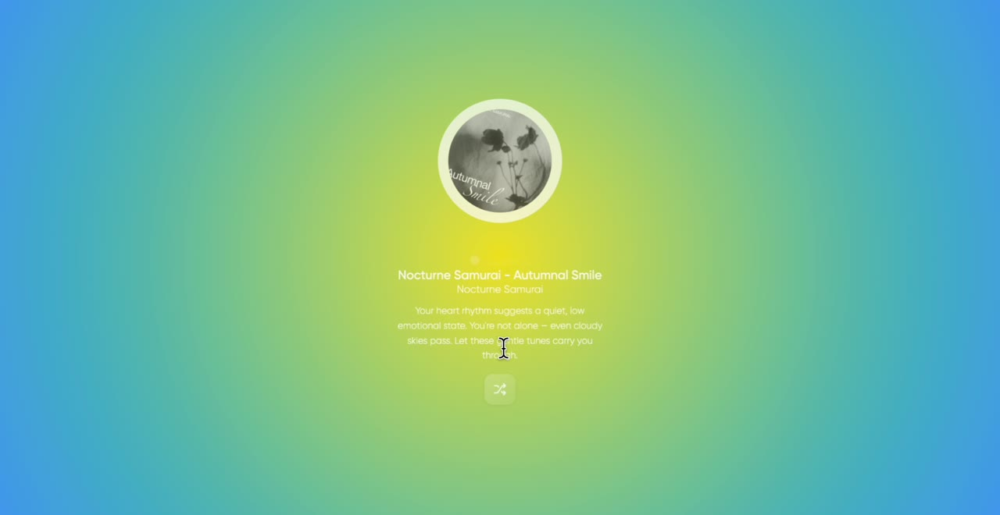

# Zen Music Recommender

## English

Zen Music Recommender is an emotion-aware music recommendation prototype that maps heart-rate input to an emotional state and returns a matching music experience. The project combines ECG-derived emotion modelling, a curated music metadata library, and a lightweight Flask web interface.

## Demo

[](docs/assets/demo-preview.mp4)

The demo preview is a muted and cropped version of the original screen recording. It shows the local Flask web app running at `127.0.0.1:5000`, including BPM input, emotion-based music recommendation, animated playback visuals, and the feedback popup.

## Project Stage

Prototype / proof of concept

## Core Features

- Heart-rate BPM input with validation for realistic user values.
- Emotion mapping for `Happy`, `Sad`, and `Calm` states.
- Music recommendation from a structured JSON library.
- Playback page with track metadata, emotion text, and synchronized visual animation concepts.
- Generated public-safe demo audio for browser playback.
- Feedback popup for checking whether the recommended music matches the user's perceived emotion.

## Architecture

- Frontend: Flask/Jinja HTML template in `templates/index.html`.
- Backend: Flask routes in `app.py` for input handling, recommendation, result rendering, and reset.
- Data: `music.json` stores emotion-tagged track metadata; `predictions.json` stores BPM-to-emotion mappings.
- Modelling: `emotion_model.ipynb` records the ECG/HRV feature extraction and Random Forest experiment.

## Methods

- ECG and heart-rate variability feature extraction using NeuroKit2.
- Feature set: `RMSSD`, `SDNN`, `LF_HF`, and average `BPM`.
- Random Forest classifier for emotion prediction.
- Static JSON lookup for fast demo-time emotion mapping.

## Results Snapshot

- 15 curated music records across 3 emotion classes.
- 5 tracks per emotion class.
- 50 BPM-to-emotion prediction mappings.
- BPM prediction range in the exported mapping: 52 to 131.
- Notebook training output accuracy: 83.33%.

## Run Locally

```bash
pip install -r requirements.txt
python app.py
```

Open:

```text
http://127.0.0.1:5000
```

Run smoke tests:

```bash
pip install -r requirements-dev.txt
python -m pytest
```

## Repository Notes

The public repository includes a runnable Flask demo with generated placeholder audio and CSS-based visual effects. Original reports, slide decks, raw recordings, private identifiers, local environment details, and redistribution-sensitive media assets are not included. Additional public-safe demo evidence is documented in `docs/demo-evidence.md`.

## 中文

Zen Music Recommender 是一个情绪感知音乐推荐原型系统。项目将心率 BPM 输入映射到情绪状态，并根据情绪返回匹配的音乐推荐体验。项目结合了 ECG/HRV 情绪建模、结构化音乐元数据和轻量级 Flask Web 界面。

## 演示

[](docs/assets/demo-preview.mp4)

这个演示视频是从原始录屏中裁剪、静音并压缩得到的公开预览版本。视频展示的是运行在 `127.0.0.1:5000` 的本地 Flask 网站，包括 BPM 输入、基于情绪的音乐推荐、动态播放视觉效果和反馈弹窗。

## 项目阶段

原型 / 概念验证

## 核心功能

- 支持心率 BPM 输入，并对用户输入范围进行校验。
- 支持 `Happy`、`Sad`、`Calm` 三类情绪映射。
- 基于结构化 JSON 音乐库进行推荐。
- 播放页面展示曲目信息、情绪文案和同步视觉动画概念。
- 使用公开安全的合成 demo 音频支持浏览器播放。
- 提供反馈弹窗，用于判断推荐音乐是否匹配用户主观感受。

## 项目架构

- 前端：`templates/index.html` 中的 Flask/Jinja HTML 模板。
- 后端：`app.py` 中的 Flask 路由，负责输入处理、推荐逻辑、结果渲染和重置。
- 数据：`music.json` 存储情绪标注音乐元数据，`predictions.json` 存储 BPM 到情绪的映射。
- 建模：`emotion_model.ipynb` 记录 ECG/HRV 特征提取和 Random Forest 实验。

## 方法

- 使用 NeuroKit2 从 ECG 数据中提取心率和心率变异性特征。
- 特征包括：`RMSSD`、`SDNN`、`LF_HF` 和平均 `BPM`。
- 使用 Random Forest 分类模型进行情绪预测。
- 使用静态 JSON 映射支持 demo 阶段的快速情绪匹配。

## 成果概览

- 音乐库包含 15 条精选音乐记录，覆盖 3 类情绪。
- 每类情绪包含 5 首音乐。
- 导出 50 条 BPM 到情绪的预测映射。
- 预测映射中的 BPM 范围为 52 到 131。
- Notebook 训练输出准确率为 83.33%。

## 本地运行

```bash
pip install -r requirements.txt
python app.py
```

打开：

```text
http://127.0.0.1:5000
```

运行基础测试：

```bash
pip install -r requirements-dev.txt
python -m pytest
```

## 仓库说明

公开仓库包含一个可运行的 Flask demo，并使用合成占位音频和 CSS 视觉动效。原始报告、幻灯片、原始录屏、个人身份标识、本地环境细节和可能涉及再分发授权的媒体素材没有直接公开。脱敏后的 demo 证据记录在 `docs/demo-evidence.md`。
