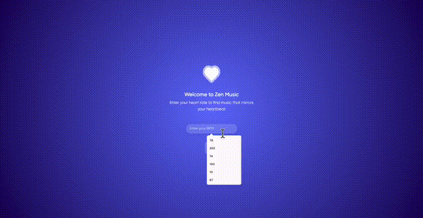

# PulseScape

PulseScape is a heartbeat-based music recommendation sanctuary. It maps a user's current heart-rate BPM to an emotional listening state, recommends a matching track, explains the recommendation, and presents the music inside a scenic immersive player.

The project began as **Zen Music Recommender**, an emotion-aware music recommendation prototype using ECG/HRV-inspired modelling and a curated music metadata library. It has now been redesigned into a more polished web demo suitable for GitHub, portfolio review, and Vercel deployment.

## Demo Preview

[](docs/assets/demo-preview.mp4)

Click the animated preview to open the MP4: [docs/assets/demo-preview.mp4](docs/assets/demo-preview.mp4)

The older preview shows the original local Flask prototype. The current UI has been redesigned with a PulseScape visual direction: full-screen scenic backgrounds, BPM input, recommendation room, similar tracks, and browser favorites.

## Current Features

- Heart-rate BPM input with validation.
- BPM-to-emotion mapping using exported predictions plus a rule-based fallback.
- Transparent recommendation scoring using emotion, tempo, energy, and valence.
- Immersive recommendation room with a track-specific scene image.
- "Why this track" explanation.
- Similar-track recommendations.
- Clickable library and similar-track cards that open the selected track in the player.
- Music library page with richer metadata.
- Browser `localStorage` favorites.
- Session-based feedback with `Like`, `Not for me`, and after-listening BPM.
- 10 public MP3 tracks under `static/audio/public/` with license/source/attribution metadata.
- Public-safe demo audio fallback when licensed track files are not included.
- Vercel configuration for deployment.

## Architecture

- Backend: Flask routes in `app.py`.
- Frontend: Jinja template in `templates/index.html`.
- Styling: `static/css/style.css`.
- Data: `music.json` for music metadata and `predictions.json` for BPM emotion predictions.
- Modelling evidence: `emotion_model.ipynb` records the ECG/HRV feature extraction and Random Forest experiment.
- Design brief: `DESIGN.md`.
- Chinese roadmap: `docs/项目现状与下一步.md`.
- Public media sourcing notes: `docs/public-media-sourcing.md`.
- Scene image API setup: `docs/scene-image-api-setup.md`.
- MongoDB expansion plan: `docs/mongodb-expansion-plan.md`.
- Candidate public music metadata: `data/public_music_candidates.json`.

## Recommendation Logic

The recommender ranks tracks with a lightweight scoring model:

```text
score =
  emotion_match * 40
+ bpm_closeness * 30
+ energy_match * 15
+ valence_match * 10
+ small_random_variation
```

This keeps the demo explainable while still making recommendations feel more intentional than random selection.

## Background Images

Each track can define a `scene_image` field in `music.json`. The current demo uses stable remote image URLs as visual placeholders so each track can have a different scene without manually uploading every background.

For a production-quality public demo, replace these placeholders with images from sources such as Pixabay, Pexels, Unsplash API, or manually selected licensed images. Always record `source_url`, `license`, and `attribution`.

This repo includes a helper script for API-based image replacement:

```bash
$env:PEXELS_API_KEY="your-key"
python scripts/fetch_scene_images.py pexels

$env:PIXABAY_API_KEY="your-key"
python scripts/fetch_scene_images.py pixabay
```

## Public Media

The app now includes 10 downloaded public MP3 files under `static/audio/public/`. These records have been added to `music.json` with playable `filepath`, `source_url`, `license`, and `attribution`.

The file `data/public_music_candidates.json` still lists additional public-safe candidate tracks, mainly from Pixabay Music, for future expansion.

Pixabay direct downloads may require a browser session because of bot protection. When that happens, download the MP3 manually from the page, place it under `static/audio/public/`, and update `music.json`.

## Run Locally

```bash
pip install -r requirements.txt
python app.py
```

Open:

```text
http://127.0.0.1:5000
```

Run tests:

```bash
pip install -r requirements-dev.txt
python -m pytest
```

## Deploy to Vercel

This repo includes `vercel.json` for a Flask deployment through Vercel's Python runtime.

```bash
npx vercel link
npx vercel deploy --prod --yes
```

## Project Stage

Prototype / portfolio-ready web demo.

The repository includes generated public-safe demo audio and remote placeholder backgrounds. Original reports, slide decks, raw recordings, private identifiers, local environment details, and redistribution-sensitive media assets should be reviewed before public release.

## 中文说明

PulseScape 是一个根据用户当前心率 BPM 推荐音乐的 Web Demo。用户输入 BPM 后，系统会推断当前状态，并根据歌曲的 BPM、情绪、energy、valence 等字段推荐歌曲。

目前已经完成：

- 心率输入。
- 情绪映射。
- 评分推荐。
- 沉浸式播放器。
- 每首歌不同背景图字段。
- 推荐原因解释。
- 类似音乐推荐。
- 收藏功能。
- Like / Not for me / 听后 BPM 反馈功能。
- 音乐库页面。
- 已接入 10 首真实可播放 MP3。
- 音乐库和类似音乐卡片可以点击进入播放器。
- Vercel 部署配置。

更详细的中文项目说明和下一步计划见：[docs/项目现状与下一步.md](docs/项目现状与下一步.md)。
